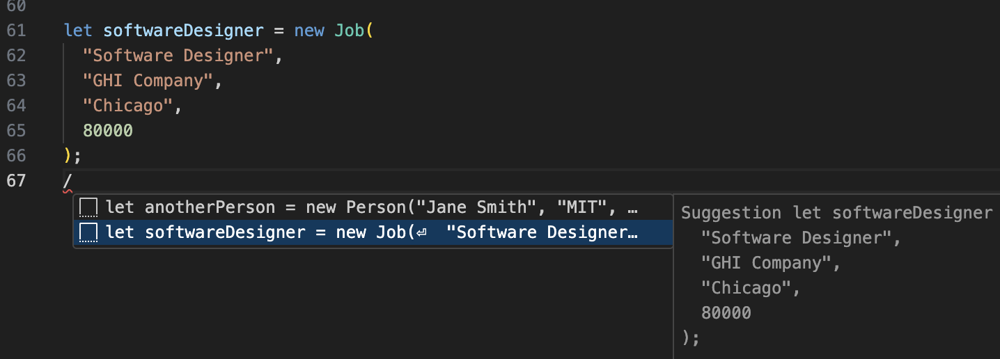

# ollama-copilot README

This extension integrates AI capabilities into VS Code, providing intelligent code suggestions, detecting boilerplate code, and offering inline completions. It also includes a Webview interface for user interactions with the AI, enhancing coding efficiency and productivity.

## Installation

Remote:
Install [Ollama](https://ollama.com/) on dedicated machine and configure endpoint to it in extension settings. Ollama usually uses port 11434 and binds to 127.0.0.1, to change it you should set OLLAMA_HOST to 0.0.0.0.

Running a forwarding server on host machine:
Ctrl+Shift+P or Cmd+Shift+P: Change ollama url to HostMachine.ip.address:port e.g: http://192.168.1.100:3000/forward
Requirement: Node installed on host machine.
npm install the dependencies of the forwarding server.
Run the server.
(Javascript | axios | cors)
[Forwarding sever](./proxy-server.js)

Local:
Install [Ollama](https://ollama.com) on local machine and then launch the extension in VSCode, everything should work as it is.

Github: [Ollama Github](https://github.com/ollama/ollama)

## Recommend Hardware

Minimum required RAM: 8GB is a minimum, more is better since even smallest model takes 5GB of RAM. The best way: dedicated machine with RTX 4090. Install [Ollama](https://ollama.com) on this machine and configure endpoint in extension settings to offload to this machine. Second best way: run on MacBook M1/M2/M3 with enough RAM (more == better, but 10gb extra would be enough). For windows notebooks: it runs good with decent GPU, but dedicated machine with a good GPU is recommended. Perfect if you have a dedicated gaming PC.

## Features

Ollama webview

Directly interact with whatever model you are running by using the webview from the chat extension.

You can also query the model inline:

Once a response is received it will store it in your suggestions which you can see by typing '/'

The app will scan your current document every 25 secs checking for boiler plate code in order to speed up the development process.

`Commands:`

- / - will open the suggestions menu if you have any suggestions.

- //ai {prompt} - Will send an inline query to the model.

- //ai clear - Will empty your ai suggestions box. It keeps a backup.

- //ai restore - Will restore your ai suggestions if you have any.

> Tip: Smaller models may not understand the instructions needed to have the extension work properly. Recommended model is llama3 or higher.

## Requirements

A working server that will listen to post commands at the set url. This server should return string JSON in order for the application to process it correctly.

By default the app will listen to `http://localhost:11434/api/generate` because this is the default port of Ollama.

By default the app will use `llama3` for the model name in the request.

## Extension Settings

Include if your extension adds any VS Code settings through the `contributes.configuration` extension point.

For example:

This extension contributes the following settings:

- `Set Ollama URL`: Sets where the api request will go to. This is useful if you want to host the model on a separate machine or use a server in the middle of your requests. By default set to `http://localhost:11434/api/generate`
- `Set Ollama Model`: Sets the model name included in the request. By default set to: `llama3`

## Known Issues

- No ability to cancel requests.
- No ability to turn off model.
- Does not prompt users what model or url their model is running on in the event of an error.
- Cannot set ai trigger for the inline prompts.
- No ability to take in images.

## Troubleshooting

If you are getting an error it most likely means your model is not running or your extension settings are not pointed to your correct model / url.

## Changelog

### 0.0.5

Initial release of Ollama copilot

## Contributing

data = response.message.content;
Ollama_copilot is open-source under the MIT license. See the [LICENSE](./LICENSE) for more details.

**Enjoy!**
